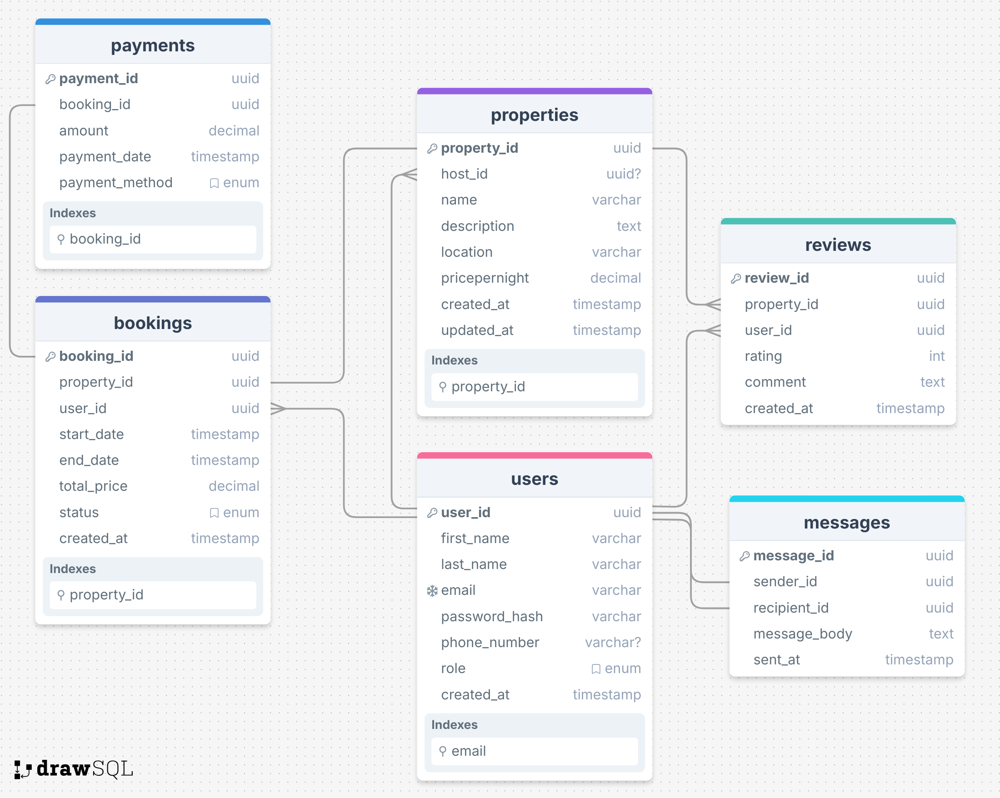

# Airbnb Database Normalization

## Objective

To ensure that the Airbnb database schema adheres to the Third Normal Form (3NF) by eliminating redundancy and dependency anomalies while maintaining data integrity and query efficiency.



## Normalization Principles Overview

### First Normal Form (1NF)
- **Rule**: Atomic values, no repeating groups.
- ✅ *All tables comply*. All attributes store atomic, scalar values (e.g., no lists, sets, or nested structures).

### Second Normal Form (2NF)
- **Rule**: 1NF + No partial dependency on composite keys.
- ✅ *All tables use single-column primary keys (UUIDs)*, so 2NF is automatically satisfied.

### Third Normal Form (3NF)
- **Rule**: 2NF + No transitive dependencies (non-key attributes must depend only on the primary key).
- 🟨 *Minor opportunities for improvement noted* (see below).


## Observations and Adjustments

### 1. `User.phone_number`
- ✅ Currently nullable, atomic, and does not violate 3NF.
- 🔍 *Optional Enhancement*: Move phone numbers to a separate `user_contacts` table if you plan to support multiple phone numbers per user in the future.
  
```sql
-- Optional normalization
CREATE TABLE user_contacts (
  contact_id UUID PRIMARY KEY,
  user_id UUID REFERENCES user(user_id),
  phone_number VARCHAR NOT NULL,
  type ENUM('mobile', 'home', 'work'),
  created_at TIMESTAMP DEFAULT CURRENT_TIMESTAMP
);
````


### 2. `Property.pricepernight`

* ✅ Acceptable in current context.
* 🔍 *Scalability note*: If pricing becomes dynamic (e.g., seasonal or based on demand), consider moving this to a `pricing` table with date ranges.

```sql
-- Optional normalization
CREATE TABLE pricing (
  pricing_id UUID PRIMARY KEY,
  property_id UUID REFERENCES property(property_id),
  price DECIMAL NOT NULL,
  start_date DATE NOT NULL,
  end_date DATE NOT NULL
);
```


### 3. `Booking.total_price`

* 🟨 **Potential 3NF Violation**: Derived value — it can be calculated from `pricepernight * nights`.
* ✅ Justified denormalization for performance.
* 📝 *Recommendation*: Keep as-is **if** bookings can have discounts, fixed totals, or dynamic price adjustments. Otherwise, calculate on the fly.


### 4. `User.role`

* ✅ ENUM type. No transitive dependency exists.
* 🔍 *If role permissions grow complex*, move to a separate `roles` and `permissions` table.

```sql
-- Optional enhancement
CREATE TABLE roles (
  role_id UUID PRIMARY KEY,
  name VARCHAR UNIQUE NOT NULL
);

CREATE TABLE user_roles (
  user_id UUID REFERENCES user(user_id),
  role_id UUID REFERENCES roles(role_id),
  PRIMARY KEY(user_id, role_id)
);
```


### 5. Messages

* ✅ Message model is normalized.
* 📝 Self-referencing FK relationships (sender\_id, recipient\_id) are well-designed.


## Final Verdict

✅ The current schema **meets 3NF** requirements.

No critical transitive or partial dependencies exist.
Some fields (like `total_price` or `pricepernight`) may look redundant but are **purposeful denormalizations** for performance and business logic clarity.


## Summary

| Table    | 1NF | 2NF | 3NF | Notes                                       |
| -------- | --- | --- | --- | ------------------------------------------- |
| User     | ✅   | ✅   | ✅   | Consider future role/permissions separation |
| Property | ✅   | ✅   | ✅   | Price could be externalized for flexibility |
| Booking  | ✅   | ✅   | 🟨  | total\_price is derived but acceptable      |
| Payment  | ✅   | ✅   | ✅   | Fully normalized                            |
| Review   | ✅   | ✅   | ✅   | Fully normalized                            |
| Message  | ✅   | ✅   | ✅   | Fully normalized                            |


